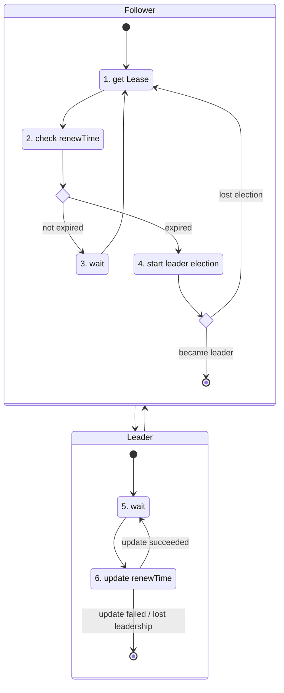

# Use Kubernetes Lease objects to implement leader election for a group of pods

When building high available systems, several instances redundantly share the work load. In case one of the instances fails, the other instances will take over. These scenarios often have the challenge of keeping a consistent shared state. A common solution for this challenge is a split of responsibilities between the instances. One instance is the leader, who maintains the shared state and the other instances follow the leader by replicating the state. A mechanism is needed to select the leader and to repeat the selection is case the leader fails. This process is called leader election.

Kubernetes comes with built-in support for the [Lease](https://kubernetes.io/docs/reference/kubernetes-api/cluster-resources/lease-v1/) objects, that can be used for leader election (see https://kubernetes.io/docs/concepts/architecture/leases/). The [spec](https://kubernetes.io/docs/reference/kubernetes-api/cluster-resources/lease-v1/#LeaseSpec) of the Lease object has five fields:

- **acquireTime**
  acquireTime is a time when the current lease was acquired.

- **holderIdentity**
  holderIdentity contains the identity of the holder of a current lease.

- **leaseDurationSeconds**
  leaseDurationSeconds is a duration that candidates for a lease need to wait to force acquire it. This is measure against time of last observed renewTime.

- **leaseTransitions**
  leaseTransitions is the number of transitions of a lease between holders.

- **renewTime**
  renewTime is a time when the current holder of a lease has last updated the lease.

## Leader Election flow

Every instance starts as a follower.

1. The instance retrieves the lease from the cluster or creates a new one if it does not yet exist.
2. The instance checks the *renewTime* of the lease. If it is missing or it has not been updated for *leaseDurationSeconds*, it starts a new leader election. Otherwise, it waits until the lease expires.
3. If the lease is sill valid (i.e. the leader keeps updating the renewTime), the instance waits until the lease expires and restarts the loop.
4. In the leader election process, every instance tries to update the *holderIdentity*, *leaseDurationSeconds* and *renewTime* of the lease. It may also update the *acquireTime* and *leaseTransitions* for housekeeping. The optimistic version locking of the Kubernetes API server will make sure that only one of the updates succeeds. The other instances will receive a conflict error message. If the update succeded, the instance has become the new leader. All other instances remain followers and keep monitoring the lease.
5. If the update succeeded, the instance has become the new leader. As a leader, the instance is responsible to update the *renewTime* of the lease at least every *leaseDurationSeconds*. If will usually wait until the lease is about to expire and update the *renewTime* shortly before expiration.
6. The leader updates the lease regularily at least every *leaseDurationSeconds*. If it fails to update the lease on time, the followers will start a new leader election. The instance will become a follower again in this case.

## The Sample Program

The sample program has three main functions: *get_lease*, *update_lease* and *acquire_lease*.

**get_lease** is used to get the latest data for the lease. If the lease does not exist yet, it will be created.

**update_lease** will try to update the lease with the information of the current instance. In particular, it will set the *holderIdentity* to the process id of the instance. It also updates the *renewTime* and *leaseDurationSeconds* accordingly. If there was a transition (i.e. the holderIdentity of the lease does not match the current instance identity), *acquireTime* and *leaseTransitions* will be updated as well. The function is used both, in the leader election process and the leader haertbeats.

**acquire_lease** tries to set the current instnace as the new leader. This is only allowed if the lease has expired (i.e. the leader failed to update the renewTime). Several instances may try to become the new leader at the same time and only one will succeed. The function returns only if it has won the leader election and the instance is now the new leader. Otherwise, it will keep trying.

There is a utility function named *wait until* that will simply put the current thread to sleep until the specified time.

In the main loop, the leader keeps updating the *renewTime* of the lease when it is about to expire.

The programm can be started multiple times and one will be come the leader while the others will follow.
